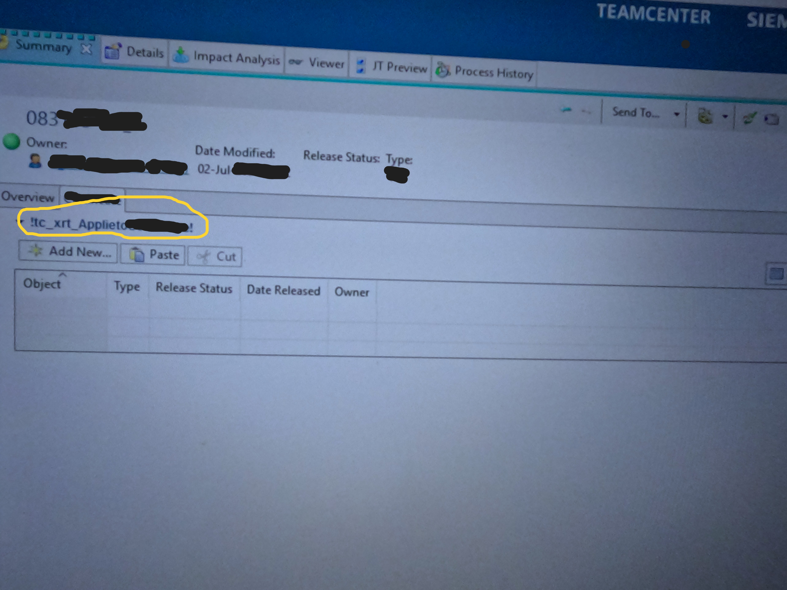
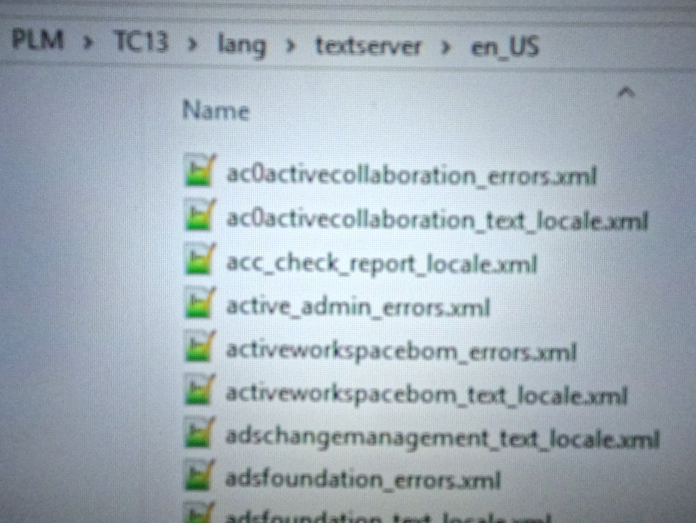
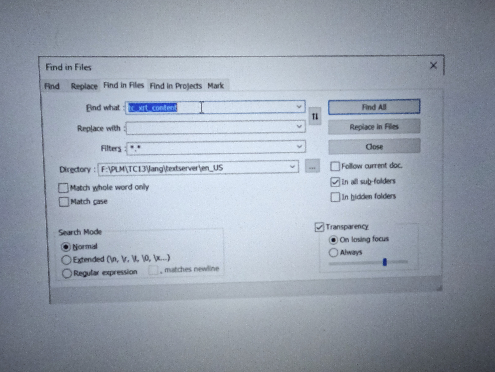
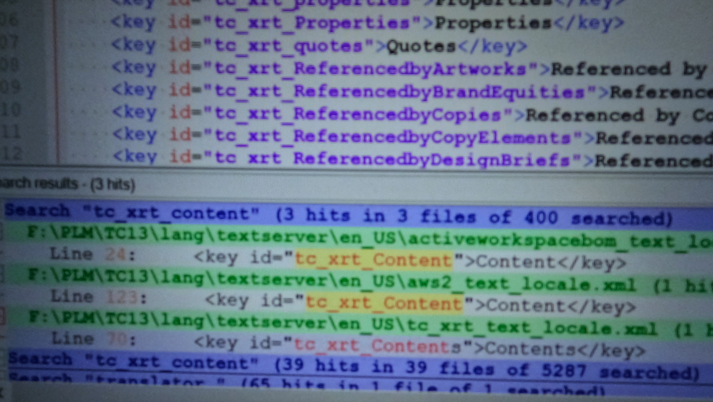
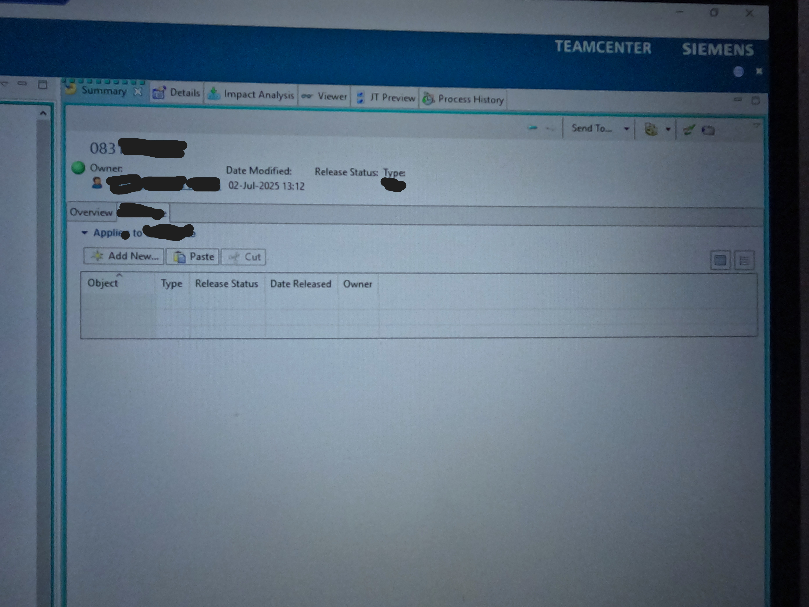

# How to remove exclaimation mark on the text in tab of item revision in Teamcenter Richclient.

If you come here than surely you are facing the problem of exclaimation mark in Teamcenter like :

This exclaimation mark is coming because , teamcenter is not able to recognize your word, to make teamcenter recognize it you have to include your word in textserver.

So open , en_US folder of textserver , you have to open your language folder , like i am using english so i am opening en_US like :

As you know very Well for Content Word , We used to write , tc_xrt_content in teamcenter , so my logic is that Wherever this tc_xrt_content is defined in teamcenter there I will define my word.

So I am opening Notepad++ , than go to search ->find in files , Here give the above path till en_US in Directory & in Find What give "tc_xrt_content" like :

Than Click on Find All , It will display result like -

Now click on result & write your word there which you want to use without exclaimation mark & save the file.

Now you can see your word without exclaimation mark like :

Thanks for Reading !
