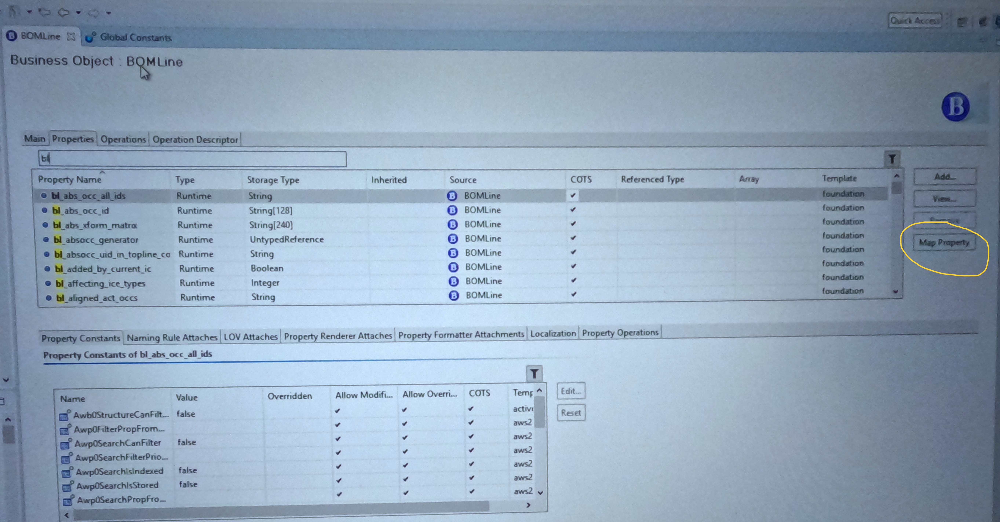

# Column Configuration | How to configure columns in content section of AWC or structure manager of Teamcenter RAC | UI Config File.

We can do Column Configuration for AWC & Rich Client Teamcenter in below few easy steps:

## 1- Export UI Config file from Teamcenter

You have to first export the existing ui config file which is present in the Teamcenter.
Please give this command to export ui config :

export_uiconfig -u=infodba -p=infodba -g=dba -file=F:\folder_1\exported.xml

Above command will export the ui config file in the given location.

## 2- Update the Global Constant Fnd0BOMLineRevConfigProps

Open BMIDE -> go to Global Constant -> Fnd0BOMLineRevConfigProps like :

In this Global Constant you have to give the name of custom Business Object on which you are doing this column configuration.

## 3 - Creation of Conditional Element

Open BMIDE -> go to business objects -> Awb0ConditionalElement -> create new BO(To display column names values)

## 4 - Mapping of BOM Line Property to Conditional BO

Open BMIDE -> go to business objects -> Bom Line -> You will find all the custom property of business object which you mention on global constant Fnd0BOMLineRevConfigProps ->
property starting from "bl\_" -> click on property -> click on map -> give the name of conditional BO you created in step 3

## 5 - Deploy BMIDE

Please deploy these changes in Teamcenter

## 6 - Open the exported UI Config File

Now you can see multiple column configuration in the UI Config File , We have to create one for Content so write like this :

<ColumnConfig ColumnConfigId="contentColConfig" columnConfigName="your_custom_name" >

<ColumnDef......>

</ColumnConfig>

## 7 - Import Ui Config

import_uiconfig -u=infodba -p=infodba -g=dba -file=F:\folder_1\exported.xml

Above Command will export your configured uiconfig

## 8 - See your Config in AWC

Go to ItemRevision-> Content Section -> settings -> Arrange like:

NoW Select your custom column config , which you created & use it.

Thanks for Reading !
