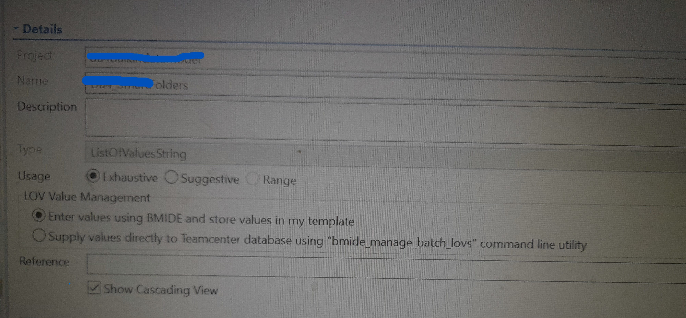

# How to create Folders & SubFolder Of Business Objects in Project list of Smart Folder Filter Configuration

## 1- Adding autoAssignToProject Post Action Extension

Open the business object , which you want to see in the Project.
Open the Operations tab , in that open ITEM_create operation -> Extension Attachment ->Add Post Action -> choose autoAssignToProject like:

Now if you want to display a business object in a project , than you can follow above step.

This step lead only assignment of Project , Where business object would be visible in Project, If you want to display business object in specific folder of Project , than you need to follow below steps.

## 2- Creation of Classic Lov

If you want to create the folder structure in the Project , than you have to give the list of those folder in the Classic lov.

Same , if you want to create the sub folder inside the folder in the Project , than you have to create the sub lov , inside that classic lov, those sub lov of the lov value would work as sub folder of folder structure.

To show the sub lov option , you have to click on show cascading view like :

## 3- Update the Global Constant

After creation of classic lov , you have to update 2 Global Constant:

### A - DefaultProjectSmartFolders Global Constant

Here give value as the name of LOV , you created in step 2 for folder structure like :

### B - ProjectSmartFolders Global Constant

Same to Same as above global constant , give the value of lov which you have created in step 2.

## 4- Filter settings in Smart Folder Filter Configuration

When you , will deploy the BMIDE after above 3 steps , than you will see the folder structure in Smart Folder Filter Configuration , but the thing is that , if you want to show a specific business object in specific folder than you have to apply filter like -

Thanks for Reading !
