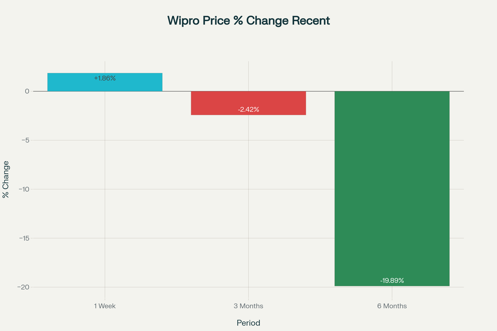

# Wipro Stock Outlook 2025: Key Short-Term and Long-Term Factors Driving Price Movement

Explore the comprehensive Wipro Stock Outlook for 2025 with the latest analysis on the key factors driving its price movement in both the short and long term. This article covers real-time market insights including recent large deal wins, AI-driven digital transformation initiatives, and robust profit growth that could boost Wipro’s stock price. It also examines potential risks such as weak revenue guidance, operational execution challenges, and global macroeconomic uncertainties that might impact the stock negatively. Whether you are a short-term trader or a long-term investor, learn all the essential drivers and risks shaping Wipro’s stock performance in the coming months and years.

## Key Short-Term Factors (Next 10 Days to 1 Month)

Momentum from Large Deals: Recent $500 million contracts and strong deal pipeline supporting near-term revenue growth.

Positive Technical Indicators: Bullish signals from moving averages (5-day and 10-day EMAs) suggest potential short-term price gains.

Investor Sentiment and Trading Volumes: Rising investor participation and delivery volumes could fuel positive price momentum.

Weak Revenue Guidance: Cautious revenue outlook amid global economic concerns may constrain gains.

Operational and Leadership Challenges: Ongoing execution issues and leadership shifts causing short-term volatility.

Sector Headwinds and FII Selling: Pressure from weak IT sector sentiment and foreign institutional investor sell-offs impacting prices.

## Wipro Price as per 14 August 2025

## Wipro price Change in a Week , 3 Month & 6 Month

## Key Long-Term Factors (2025 and Beyond)

Strong Position in AI and Digital Transformation: Wipro’s investments in AI, cloud computing, and automation are expected to drive sustained revenue growth and competitive advantage.

Expansion into New Geographies and Sectors: Growth opportunities in emerging markets like Latin America, Africa, and newer verticals such as renewable energy IT that can diversify revenue.

Robust Deal Wins and Client Engagements: Large contract wins, especially with global banking, healthcare, and telecom clients, underpin long-term earnings growth.

Operational Efficiency and Leadership Execution: Cost optimization and improved productivity under leadership boosts profitability and investor confidence.

Risks from Macroeconomic Uncertainties: Possible client IT budget cuts due to recession fears, currency fluctuations, and geopolitical risks could hinder growth.

Regulatory & Talent Challenges: Visa policy changes, data privacy laws, and talent attrition in niche technology areas may impact operational capabilities.
