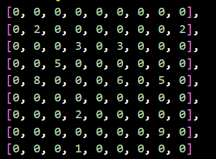

# Way to check if a number is already within a 3x3 grid in a 9x9 grid of nested lists?

We have this - 9\*9 Grid



We will take 3 inputs:-

1- Row No
2- Column No
3- No to be place in specific row & column.

If 3rd input is present in specific (row,column) of input , than it will not place that no there .

Also if 3rd input is present in that specific(row,column) 3\*3 grid like , suppose 2 is the input , than here -


As you can see in above image it is present in 3*3 grid , that's why , we can't put 2 in any specific(row,column) of that 3*3 grid.

The Python code to execute this functionality -

```python
# Define the initial Sudoku board
board = [
 [0, 0, 0, 0, 0, 0, 0, 0, 0],
 [0, 2, 0, 0, 0, 0, 0, 0, 2],
 [0, 0, 0, 3, 0, 3, 0, 0, 0],
 [0, 0, 5, 0, 0, 0, 0, 0, 0],
 [0, 8, 0, 0, 0, 6, 0, 5, 0],
 [0, 0, 0, 0, 0, 0, 0, 0, 0],
 [0, 0, 0, 2, 0, 0, 0, 0, 0],
 [0, 0, 0, 0, 0, 0, 0, 9, 0],
 [0, 0, 0, 1, 0, 0, 0, 0, 0]
]

# Function to check if a move is valid
def is_valid_move(board, row, col, num):
    # Check row and column
    if num in board[row] or any(board[i][col] == num for i in range(9)):
        return False

    # Determine the top-left corner of the 3x3 subgrid
    start_row, start_col = 3 * (row // 3), 3 * (col // 3)

    # Check the 3x3 subgrid
    for r in range(start_row, start_row + 3):
        if num in board[r][start_col:start_col + 3]:
            return False
    return True

# Main game loop
while True:
    print("Welcome to the Python Sudoku")
    print("Here's your board:")
    for row in board:
        print(row)

    print("You will have a choice to select a row, column, and the number you want to input.")
    print("To exit the game at any time, type '-1'.")

    # Get the row choice
    rowchoice = int(input("Please pick the row you wish to add the number to (0-8, or -1 to exit): "))
    if rowchoice == -1:
        print("Thanks for playing!")
        break  # Exit the loop to stop the game
    if rowchoice > 8 or rowchoice < 0:
        print("Invalid number, try again.")
        continue

    # Get the column choice
    columnchoice = int(input("Please pick the column of choice (0-8, or -1 to exit): "))
    if columnchoice == -1:
        print("Thanks for playing!")
        break
    if columnchoice > 8 or columnchoice < 0:
        print("Invalid number, try again.")
        continue

    # Get the number choice
    guess = int(input("Please pick the Sudoku guess number (1-9, or -1 to exit): "))
    if guess == -1:
        print("Thanks for playing!")
        break
    if guess > 9 or guess < 1:
        print("Invalid number, try again.")
        continue

    # Check if the move is valid and update the board
    if is_valid_move(board, rowchoice, columnchoice, guess):
        board[rowchoice][columnchoice] = guess
        print(f"Placed {guess} at ({rowchoice}, {columnchoice}).")
    else:
        print("Invalid move. Number conflicts with existing ones.")

    # Display the updated board
    print("Here's the updated board:")
    for row in board:
        print(row)
```
