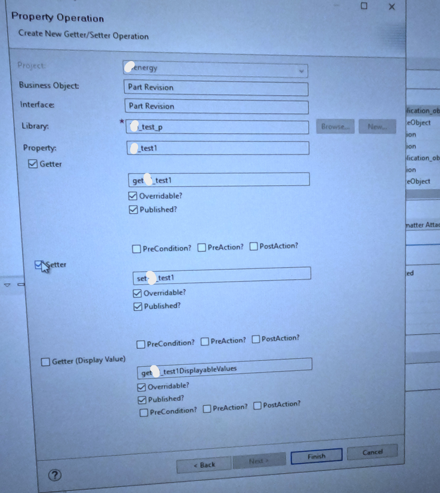

# How to create a persistent property in Teamceter ? Use getter & setter method in Persistent property of Teamcenter.

First of all Just open properties of any business object

Now click on add then choose Persistent

Now Click Next , then below tab will come , In the below tab give "Name" , "Display Name" , "Attribute Type" , "String Length" as -

Now Click Next , & you can create new library while clicking one new , then you can choose getter & setter like , also don't forget to click on published , as when you will click on published than only it will get visible in extension-

If you now look at the custom property you created, you'll find that under the 'Property Operations' section, both the 'set' and 'get' methods are already defined there :

Up to this point, most developers should be able to follow along easily.
Now comes the interesting part—the real challenge begins.
The key question is: where should you write the code for the getter and setter methods?

To proceed, you’ll first need to create a custom extension and then associate the getter and setter operations with the custom property. After that, generating the extension code becomes straightforward. Ready? Let’s begin!

Go to Rules->Extensions->New Extension Definition :

{ width=30% }

Now give the name of the extension & on availablity column click on add -:

{ width=30% }

Now choose Property , then give Business object name , property name & operation name :

{ width=30% }

After adding the availablity , go on your business object , than on that custom property which you have created , on that go to extension attachment then click on add :

{ width=30% }

{ width=30% }

Now go to Business Object - Right Click -> Generate Code -> C++ Classes :

{ width=30% }

Now you can see the generated code like :

{ width=30% }

Now you can write your custom logic of getter & setter here -->

{ width=30% }
