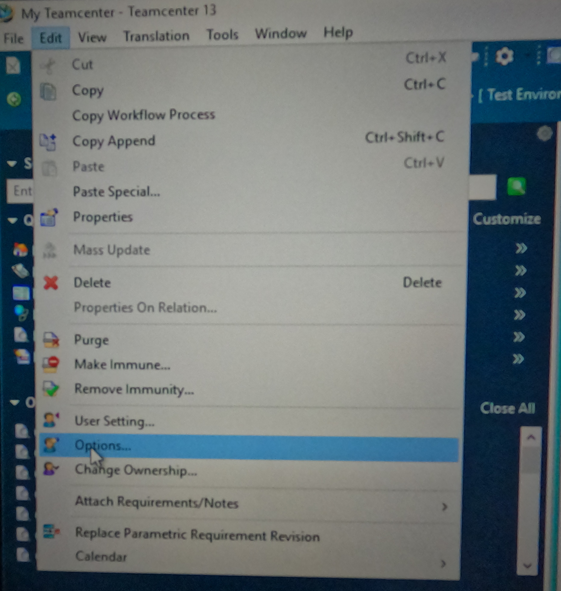
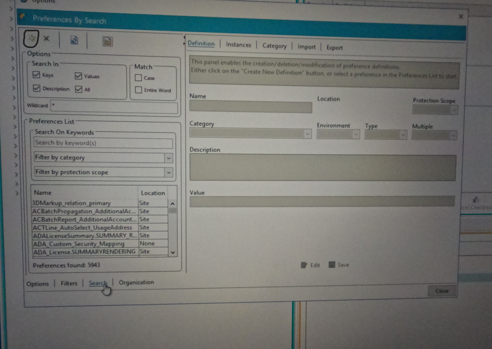
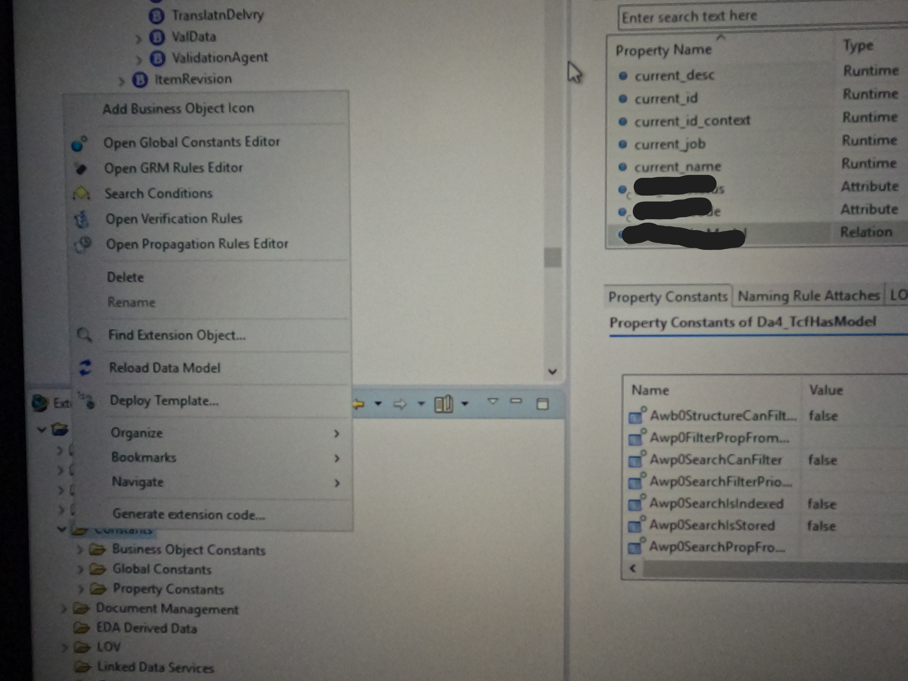
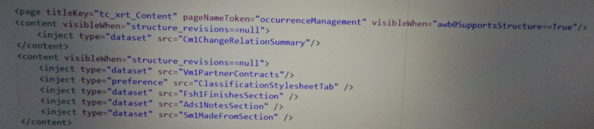

# How to add Content Tab in Active Workspace of Teamcenter.

You have to follow below 3 Steps to add content :
1- Create Prefernce
2- Update Global Constants
3- Add Code in Stylesheet

1- Create Preference
To Create Preference in Teamcenter , go to Edit->Options :

Than in Search->Click on Star yellow button in top left corner :

Give following details:
a- Name : AWC_item-revision-type.showObjectLocation.OccurenceManagementSubLocation.SUMMARYRENDERING
b- Category : Active Workspace
c- Value : Awp0_your_item_revision_name

2- Update Global Constants

After that go to Extensions->Constants->Right Click->Open Global Constants Editor like :

In Global Constants open - Awb0SupportsStructure & give the custom business object name where yoiu are putting content Tab :

3- Add Content Code in Stylesheet

Now Check whether content Code is added or not , if not then add like this :

Thanks for Reading !
