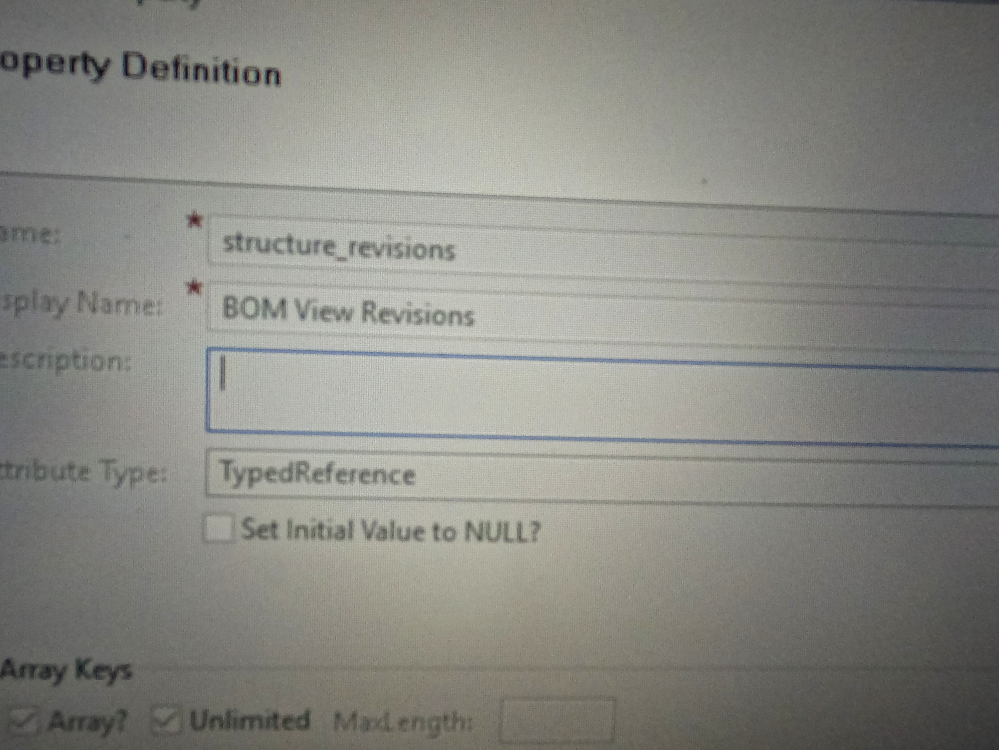
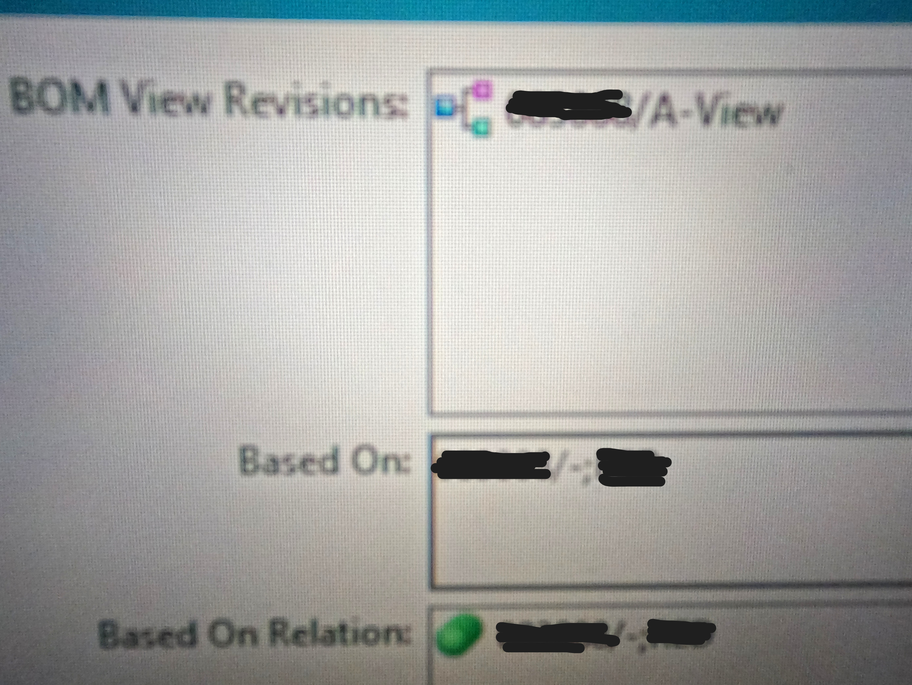
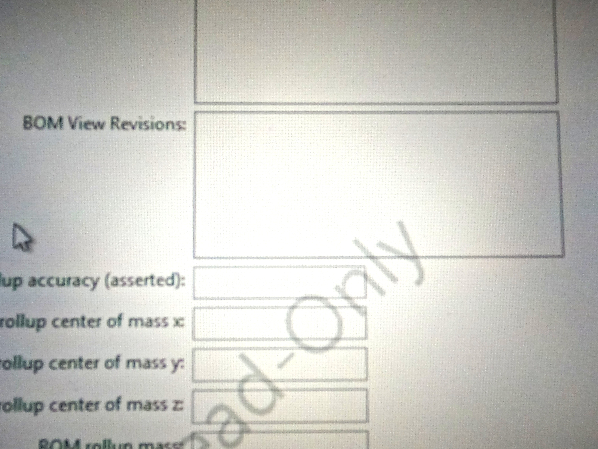

# Property on Item Revision to check if it contain the BOM Structure.

You can Check It the Item contain the BOM Structure or not by just one property.

In BMIDE you can search on any item revision as - "structure_revisions"

If you want to check Whether the BOM Present on the item revision , just you need to check the value of this property - "BOM View Revisions" , If the BOM is present it will show you like:

If the BOM is not present , It will show you like :

